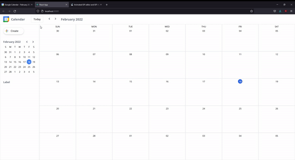
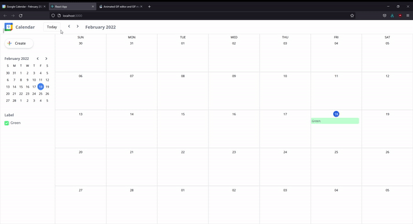

# Google Calendar for Ringle 

  ## Description 
  First Interview

  ## Table of Contents
  * [Installation](#installation)
  * [Usage](#usage)
  * [License](#license)
  * [Demo](#demo)
  * [Questions](#questions)

  
  ## Installation
  Run npm i in the terminal. Then run npm start.

  ## Usage 
  Manage your calendar and create new events.

  ## License
  This product uses a MIT license

  ## Demo
  
  

  ## Questions
  For additional questions feel free to contact: chrischo2012@gmail.com
  GitHub: https://github.com/chrischo94
  